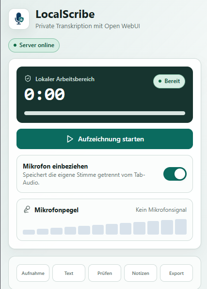

# Local Meeting Transcriber

A local-first meeting transcription workflow with a Chrome extension, Open WebUI, optional Ollama-based local inference, and local Whisper/STT.

The extension records audio from the active browser tab and can optionally record the microphone as a separate source. Audio is sent only to the Open WebUI server you configure. Open WebUI is the actual backend the extension talks to for speech-to-text and summarization. The included Docker setup uses Ollama as the default local model runtime, but Open WebUI can also be configured to use other model providers or OpenAI-compatible APIs. Meeting results are stored locally in Chrome extension storage.



## Architecture

```text
Chrome Extension
  - captures tab audio with chrome.tabCapture
  - optionally captures microphone audio with getUserMedia
  - keeps the sources as separate WebM recordings
  - sends audio to configured Open WebUI STT endpoint
  - combines transcripts with source labels
  - sends transcript to Open WebUI chat completions
  - stores meeting history in chrome.storage.local

Open WebUI
  - externally managed local/self-hosted backend
  - provides STT/Whisper and chat-compatible API access

Ollama
  - optional default local LLM runtime in the included Docker setup
```

No Open WebUI fork is used. No Open WebUI source code is modified.

## Requirements

Install these tools before you start:

- Docker Desktop or Docker Engine with the `docker compose` plugin
- Node.js 20 LTS or newer
- npm
- Google Chrome or another Chromium browser that supports unpacked extensions

You can verify the main dependencies with:

```sh
docker --version
docker compose version
node --version
npm --version
```

## Installation

### 1. Clone the repository

```sh
git clone <your-repository-url>
cd meeting-transcriber
```

### 2. Configure the local backend

1. Copy `openwebui/.env.example` to `openwebui/.env`.
2. Adjust the values in `openwebui/.env` if you want different ports, a different Ollama model, or different Whisper settings.

Default values:

- `OPEN_WEBUI_PORT=3000`
- `OLLAMA_HOST_PORT=11434`
- `DEFAULT_LLM_MODEL=gemma4:latest`
- `WHISPER_MODEL=small`
- `WEBUI_AUTH=true`

### 3. Start the included default backend stack

From `openwebui/` run:

```sh
docker compose up -d
```

This starts:

- Open WebUI at [http://localhost:3000](http://localhost:3000)
- Ollama at `http://localhost:11434`

This repository ships with Open WebUI plus Ollama as the default local stack. Ollama is not required by the extension itself; it is only required if you use this included Compose setup or if your Open WebUI instance is configured to use Ollama for model inference.

GPU tip for Ollama: the committed Compose file stays CPU-only for portability. For a local NVIDIA setup, create `openwebui/docker-compose.override.yml` and add `gpus: all` to the `ollama` service. For AMD, use Ollama's ROCm image and device mappings instead of `gpus: all`; see `openwebui/README.md` for an example.

Useful commands:

```sh
docker compose logs -f open-webui
docker compose logs -f ollama
docker compose ps
```

### 4. Check that both services are reachable

Verify manually from `openwebui/`:

```sh
docker compose ps
docker compose logs --tail=50 open-webui
docker compose logs --tail=50 ollama
```

You can also check the endpoints directly:

- Open WebUI should respond at [http://localhost:3000](http://localhost:3000)
- Ollama should respond at `http://localhost:11434/api/tags`

### 5. Pull the local model if you use the included Ollama setup

The default model is `gemma4:latest`. Pull it from `openwebui/` with:

```sh
docker compose up -d ollama
docker compose exec ollama ollama pull gemma4:latest
```

If you changed `DEFAULT_LLM_MODEL` in `.env`, pull that model instead.

If your Open WebUI instance is connected to another provider or an OpenAI-compatible API, use a model that is available there instead of pulling from Ollama.

### 6. Configure Open WebUI

1. Open [http://localhost:3000](http://localhost:3000).
2. Create or sign in to your local Open WebUI account.
3. If you use the included Compose stack, confirm Ollama is configured with `http://ollama:11434` inside Docker.
4. If you use another provider, configure it inside Open WebUI and note the model name exposed there.

### 7. Build the Chrome extension

From `extension/` run:

```sh
npm install
npm run build
```

The unpacked extension is generated in `extension/dist`.

### 8. Load the extension in Chrome

1. Open `chrome://extensions`.
2. Enable Developer mode.
3. Click `Load unpacked`.
4. Select `meeting-transcriber/extension/dist`.

### 9. Configure the extension

Open the extension settings and configure:

- Open WebUI base URL: `http://localhost:3000`
- API key or Bearer token if required by your Open WebUI setup
- Model: `gemma4:latest`, the model you pulled, or any model name exposed by your Open WebUI instance
- STT endpoint path for your Open WebUI version

The default STT endpoint expected by the extension is:

```text
/api/v1/audio/transcriptions
```

If your Open WebUI version exposes a different route, update it in the extension settings.
